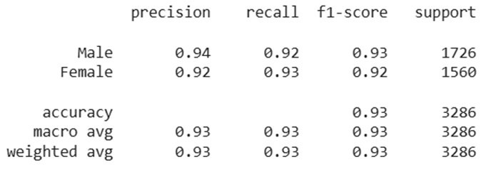
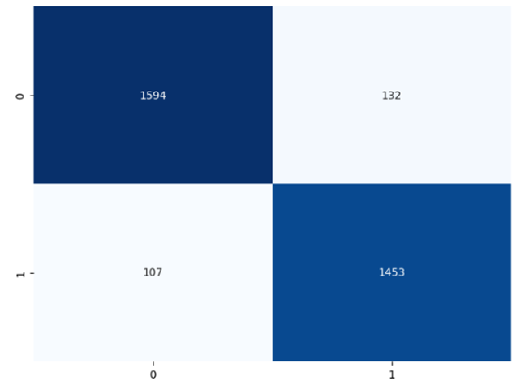
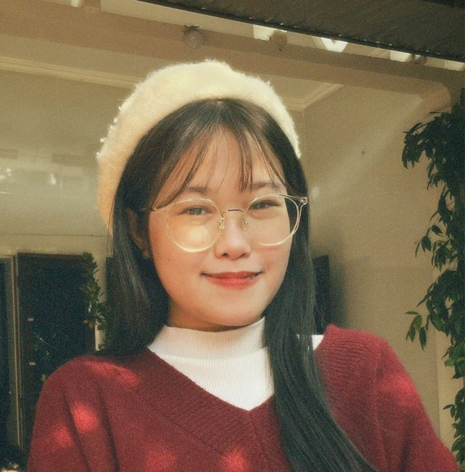

# Face Swap
## Tổng quan 
Face Swap là một chức năng nhỏ trong hệ thống Photobooth_AI. Chức năng này hoạt động theo 3 giai đoạn:
* Nhận diện giới tính
* Sinh ảnh từ văn bản
* Hoán đổi khuôn mặt

### Biểu đồ hoạt động

## Nhận diện giới tính
Mô hình nhận diện giới tính được xây dựng nhằm xác định giới tính của người dùng từ ảnh khuôn mặt, phục vụ cho việc cá nhân hóa nội udng sinh ảnh. Kết quả dự đoán của mô hình đóng vai trò là thông tin ngữ cảnh hỗ trợ quá trình xây dựng prompt và điều chỉnh nội dung ảnh sinh ra. 

Mô hình được huấn luyện với:
* Base model: ResNet-50
* Dataset: FairFace

Mô hình đạt độ chính xác cao (93%) trên tập test. Các chỉ số precision, recall và F1 – score đều cao và cân bằng giữa 2 lớp giới tính. Ma trận nhầm lẫn cho thấy mô hình không có xu hướng thiên lệch về một giới tính cụ thể.

## Mô hình sinh ảnh từ văn bản
Mô hình sinh ảnh từ văn bản (Text – to – Image) được sử dụng nhằm tạo ra hình ảnh mới dựa trên mô tả bằng ngôn ngữ tự nhiên do người dùng (quản trị viên hoặc nhân viên) cung cấp. 
Mô hình này được sử dụng dưới dạng mô hình pretrained và được truy cập thông qua dịch vụ API của Hugging Face.

## Mô hình hoán đổi khuôn mặt (faceswap)
Mô hình hoán đổi khuôn mặt nhằm thay thế khuôn mặt của nhân vật trong ảnh đích bằng khuôn mặt của người dùng, qua đó tạo ra hình ảnh mang tính cá nhân hóa cao mà vẫn giữ nguyên bối cảnh và phong cách ban đầu của ảnh. 

## Ghi chú
--------chạy file face_swap bằng lệnh: 
python face_swap.py --source đường_dẫn_ảnh_nguồn (ảnh cung cấp mặt) --target đường_dẫn_ảnh_đích (ảnh cần mặt) --output đường_dẫn_kết_quả
---------------------------------
--------Chạy file tạo prompt-----:
python text_to_image.py --source đường_dẫn_ảnh_nguồn (ảnh cung cấp mặt) --prompt đường_dẫn_prompt --output đường_dẫn_kết_quả

sample faceswap: python face_swap.py --source D:\mine\HocTap\kltn\face_swap_new\data\avt.jpg --target D:\mine\HocTap\kltn\face_swap_new\data\output1.png --output D:\mine\HocTap\kltn\face_swap_new\data\avt_op1.jpg